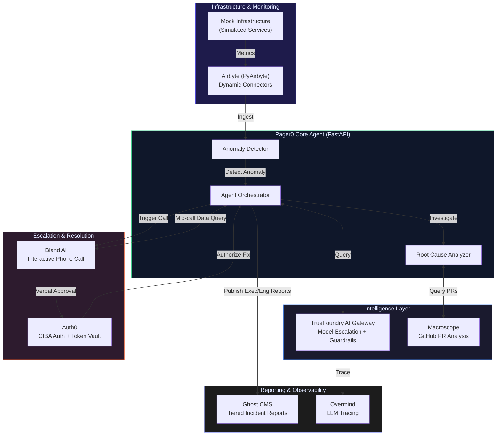
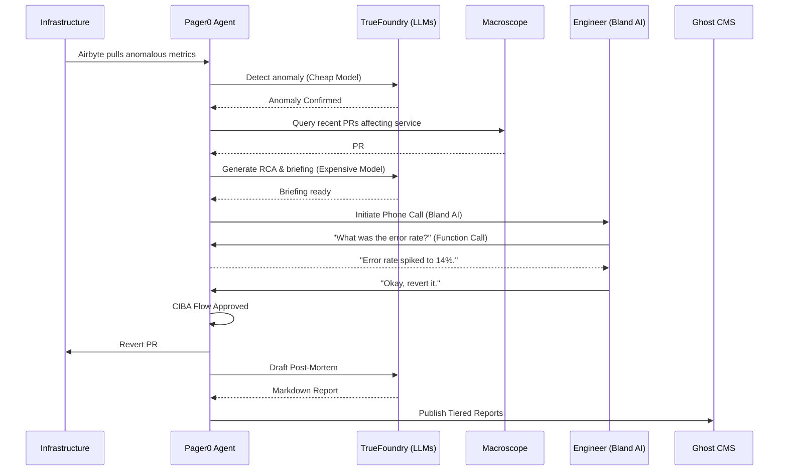

<p align="center">
  
  
  
  
  
  
</p>

<h1 align="center">Pager0</h1>
<h3 align="center">Autonomous Incident Response Agent &mdash; Zero to Remediation in 47 Seconds</h3>

<p align="center">
  An autonomous SRE agent that monitors infrastructure, detects anomalies, diagnoses root cause, calls the on-call engineer via an AI phone call, and publishes tiered incident reports &mdash; all without human intervention.
</p>

<p align="center">
  <a href="#"><strong>Submission for Deep Agents Hackathon | San Francisco, March 2026</strong></a>
</p>

---

## The Problem

**Incident response is chaotic, stressful, and slow.** When a critical service goes down at 3 AM:

| Pain Point | Impact |
|------------|--------|
| **Alert Fatigue** | Engineers wake up to vague alerts and spend 20+ minutes just finding the relevant dashboards and logs. |
| **Context Gathering** | Pulling data across multiple tools (metrics, logs, GitHub PRs) requires specialized knowledge under pressure. |
| **Communication Overhead** | Manually updating executives, customer success, and other engineers during a fire takes time away from fixing it. |
| **Slow MTTR** | The industry average Mean Time To Resolution (MTTR) is over 45 minutes, costing companies thousands per minute of downtime. |

**The result:** Burned-out engineers, frustrated customers, and significant revenue loss.

---

## The Solution

**Pager0** replaces the entire manual incident triage process. It acts as a Level 1 and Level 2 SRE that investigates issues the millisecond they occur, gathers all context, identifies the likely culprit, and then verbally briefs the human engineer to simply approve the fix.

### The "3 AM Incident" Story

> It's 3:00 AM. A bad PR is merged, causing the payment gateway latency to spike.
>
> Pager0 detects the anomaly. It dynamically spawns Airbyte connectors to pull fresh metrics. It queries Macroscope to analyze recent GitHub PRs and pinpoints the exact line of code causing the issue.
>
> Pager0 then **calls the on-call engineer on their phone**. 
> 
> *Voice Bot:* "Hi Nihal, this is Pager0. The payment gateway is experiencing high latency. I traced it to PR #42 merged 10 minutes ago. Would you like me to revert it?"
> *Engineer (half asleep):* "Uh, yeah, revert it."
>
> The verbal approval triggers an Auth0 CIBA flow. The code is reverted. Pager0 automatically drafts and publishes a highly technical post-mortem to the engineering blog, and a high-level summary to the executive dashboard via Ghost CMS.
>
> **Total time: 47 seconds.** The engineer goes back to sleep.

---

## Multimodal Pipeline Showcase

Pager0 orchestrates a complex web of tools to handle the full incident lifecycle autonomously:

| Role | Technology | What It Does |
|------|------------|--------------|
| **The Orchestrator** | Python (FastAPI) | The core agent loop that coordinates all other services and maintains state. |
| **Data Ingestion** | Airbyte (PyAirbyte) | *Dynamically* creates connectors based on the incident type to pull relevant telemetry, rather than relying on static pulls. |
| **Code Analysis** | Macroscope | Analyzes GitHub PRs to identify which recent code change likely caused the anomaly. |
| **LLM Gateway** | TrueFoundry | Proxies all LLM calls, dynamically escalating from cheap models (anomaly detection) to expensive models (root cause analysis) based on severity, while applying guardrails. |
| **Phone Escalation** | Bland AI | Executes an interactive, two-way voice call with the engineer, using function calling mid-conversation to query live data if the engineer asks questions. |
| **Authentication** | Auth0 | Uses Token Vault to manage all API credentials securely, and triggers a CIBA (Client Initiated Backchannel Authentication) flow approved via the phone call. |
| **Incident Reports** | Ghost CMS | Publishes tiered reports via the Admin API: a public executive summary and a members-only detailed technical post-mortem. |
| **Observability** | Overmind | Auto-instruments all LLM calls to trace the agent's decision-making process and provide prompt optimization recommendations. |

---

## Architecture



### Agent Handoff Flow



---

## Creative Sponsor Tool Usage

We explicitly avoided basic "checkbox" integrations. Every tool is used for an unpopular or highly creative feature:

| Tool | Basic Use (What we DIDN'T do) | Our Creative Use (What we DID) |
|---|---|---|
| **Auth0** | Slapping a login page on a dashboard | Implemented CIBA backchannel auth triggered by phone voice approval, plus using Token Vault so the agent never sees raw API keys. |
| **Airbyte** | Setting up a static daily data pull | The agent *dynamically* creates connectors on the fly based on what the incident is, pulling targeted data only when needed. |
| **Ghost** | Publishing a standard blog post | Using the Admin API to publish *tiered* incident reports: public summaries for executives, and members-only deep technical post-mortems for engineers. |
| **Bland AI** | Making a simple outbound notification call | Using Bland's pathway system with function calling, allowing the engineer to ask the bot live questions during the call before approving a fix. |
| **TrueFoundry**| Just proxying LLM calls | Implementing dynamic model escalation (using cheap models for basic parsing, escalating to expensive models for RCA) + active guardrails. |
| **Macroscope** | Just installing the GitHub app | Querying its PR reviews programmatically to identify the exact code change that caused the live infrastructure incident. |
| **Overmind** | Just adding the 2-line wrapper | Building the demo around the live optimization recommendations and tracing the agent's decision tree. |

---

## Tech Stack

| Component | Technology |
|-----------|-----------|
| **Core Agent** | Python 3.10+, FastAPI |
| **Data Ingestion** | PyAirbyte (`airbyte`) |
| **Auth & Security** | Auth0 (`auth0-python`) |
| **Phone Voice Agent**| Bland AI |
| **Reporting** | Ghost CMS |
| **LLM Gateway** | TrueFoundry |
| **Code RCA** | Macroscope |
| **Observability** | Overmind |
| **Frontend Dashboard**| Next.js 15, React |

---

## Quick Start

### 1. Setup Environment

```bash
python -m venv .venv
source .venv/bin/activate
pip install -r requirements.txt
cp .env.example .env
```

### 2. Configure API Keys

Fill in your `.env` file with the necessary credentials. Remember, we use Auth0 Token Vault, so the agent pulls keys securely.

```bash
AUTH0_DOMAIN=           # Auth0 tenant domain
AUTH0_CLIENT_ID=        # Auth0 application client ID
AUTH0_CLIENT_SECRET=    # Auth0 application client secret
BLAND_API_KEY=          # Bland AI API key
GHOST_URL=              # Ghost instance URL
GHOST_ADMIN_API_KEY=    # Ghost Admin API key (id:secret format)
TRUEFOUNDRY_API_KEY=    # TrueFoundry gateway API key
TRUEFOUNDRY_ENDPOINT=   # TrueFoundry gateway endpoint URL
OVERMIND_API_KEY=       # Overmind API key
ANTHROPIC_API_KEY=      # Anthropic API key (for TrueFoundry backend)
```

### 3. Run the Agent & Dashboard

Start the FastAPI backend:
```bash
uvicorn dashboard:app --reload --port 8000
```

*(Optional)* Start the Next.js frontend in a separate terminal:
```bash
cd frontend
npm install
npm run dev
```

### 4. Trigger the Demo Incident

```bash
curl -X POST http://localhost:8000/api/trigger-incident
```

---

## License

MIT

---

<p align="center">
  <strong>Pager0</strong> &mdash; Built for the Deep Agents Hackathon in San Francisco, March 2026.
</p>
